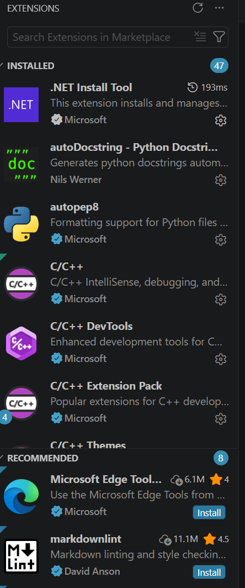

One of the great advantages of VS Code is that, although it comes with a set of basic features, it also allows users to extend its functionality through extensions. A wide range of extensions let you customise the interface to suit your task or preferences. Example uses include:

* Adding support for specific programming languages, such as:
    * Syntax highlighting
    * In-editor linting
    * Hover information
* Adding support for specific tools, such as:
    * Git/GitHub integration
    * Docker integration
    * Terminal integration
* Support for viewing or editing file types, such as:
    * Markdown preview
    * CSV editing
    * PDF viewing
* Customising the interface, such as:
    * Changing the colour scheme
    * Adding custom keyboard shortcuts

# Extensions View

Some extensions will be installed by default, and others can be installed from the VS Code Marketplace. To view installed extensions, open the Extensions view by pressing <kbd>Ctrl</kbd>+<kbd>Shift</kbd>+<kbd>X</kbd> on Windows or <kbd>Cmd</kbd>+<kbd>Shift</kbd>+<kbd>X</kbd> on macOS, or click the Extensions icon in the Activity Bar (on the left side of the interface by default):

The extensions view will look something like this:

From here you can view and manage installed extensions, or search for and install new ones. VS Code will also recommend some extensions based on your usage patterns.

# VS Code Marketplace

Another place you can find extensions is the [VS Code Marketplace](https://marketplace.visualstudio.com/vscode). This is an online store where you can browse, search, and install extensions for VS Code. Clicking "Install" on an extension will download and install it in VS Code on your machine.
